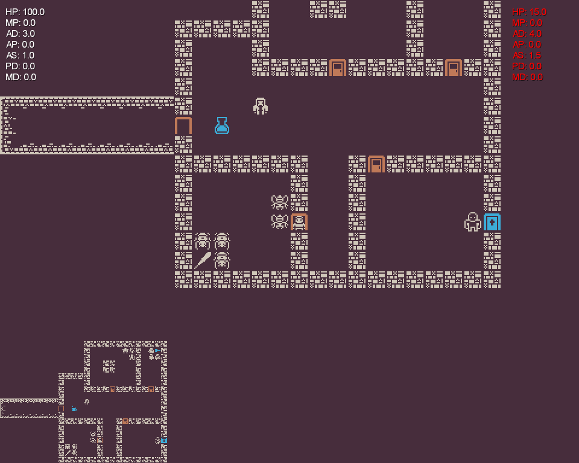

# FairyRogue

A roguelike game

| Key                        | Function                      |
| -------------------------- | ----------------------------- |
| `H/h` or `Left Arrow Key`  | to move left                  |
| `J/j` or `Down Arrow Key`  | to move downwares             |
| `K/k` or `Up Arrow Key`    | to move upwares               |
| `L/l` or `Right Arrow Key` | to move right                 |
| `F/f`                      | to interact with game objects |
| `SPACE`                    | to pick up props              |

## game running screenshot
